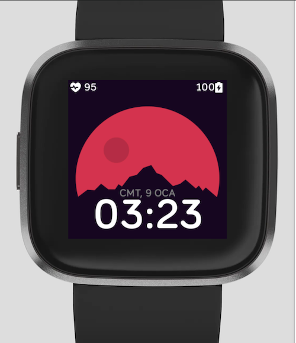

# Fitbit Mountain Clock Face

Mountain clock face for Fitbit Versa 2, Versa and Versa Lite.

## Prerequisites

You need `npm` and Fitbit SDK to build this project on your local machine. Also, you need Fitbit OS Simulator in order to run this project on a simulator.

Also, Fitbit has an online editor(Fitbit Studio) that you can use to develop your application online.

```text
https://docs.npmjs.com/downloading-and-installing-node-js-and-npm
https://dev.fitbit.com/release-notes/fitbit-os-simulator/
https://studio.fitbit.com/
```

## Installing

You have to clone the repository to your local machine

```shell
git clone https://github.com/volkanto/fitbit-mountain-face.git
```

Go to project folder

```shell
cd fitbit-mountain-face
```

Build dependencies

```shell
npm install
```

Build the application

```shell
npx fitbit-build
```

Connect to the simulator

```shell
npx fitbit
```

Install the built application to the simulator

```shell
install
```

If everything goes well and there is no error in the terminal logs, you will see the similar image like below in your Fitbit simulator.



## Built With

* [Fitbit SDK](https://dev.fitbit.com/getting-started/) - To develop applications or clock faces for Fitbit devices.
* [Fitbit OS Simulator](https://dev.fitbit.com/release-notes/fitbit-os-simulator/) - To see the application or clock faces on a local simulator.

## Issues

You can create an issue if you find any problem or feel free to create a PR with a possible fix or any other feature. Also, you can create an issue if you have any idea that you think it will be nice if we have it.

## Authors

* **Volkan Tokmak** - [github/volkanto](https://github.com/volkanto)
